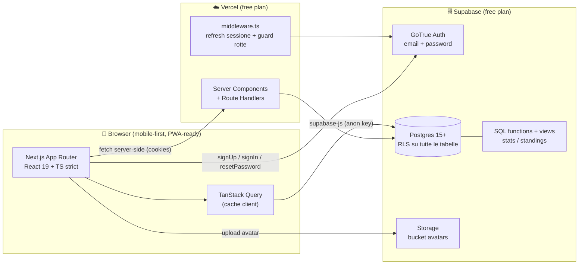
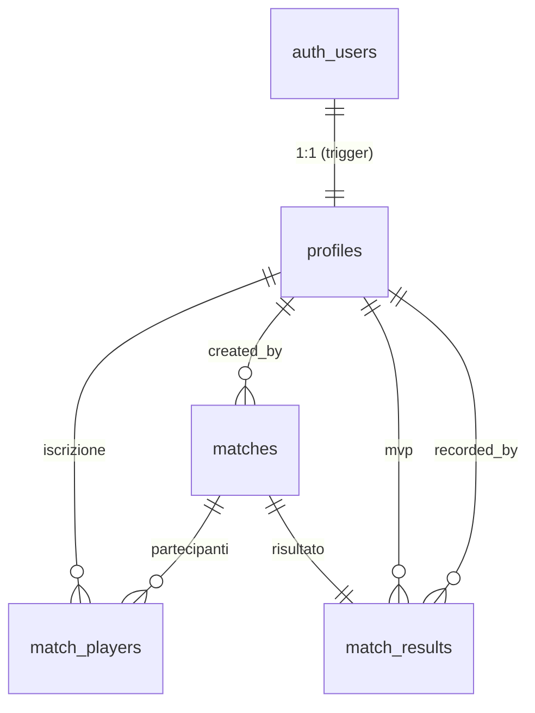
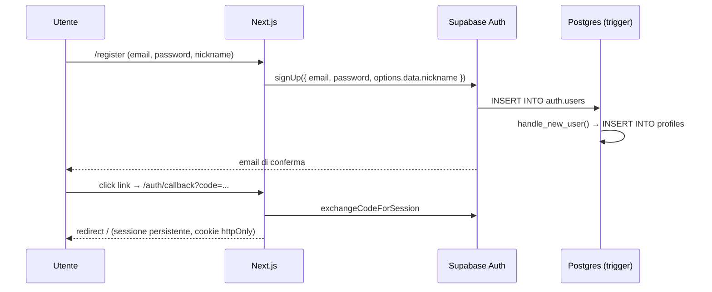

# Pall1 — Piano di implementazione

> **Progetto:** `Pall1` (si legge *pall-one* → **pallone**)
> **Tipo:** webapp gestionale per partite di calcetto tra amici
> **Repo GitHub:** `pall1` · **Progetto Vercel:** `pall1` · **Progetto Supabase:** `pall1`
> **Stack:** Next.js + TypeScript · Supabase (Postgres + Auth + RLS) · Vercel
> **Stato:** piano approvabile — nessun codice applicativo scritto

---

## 0. Assunzioni e decisioni preliminari

Il brief non è ambiguo; procedo dichiarando le assunzioni. Le decisioni con impatto
strutturale sono raccolte anche nel §10 con la relativa raccomandazione.

| # | Assunzione | Motivazione |
|---|---|---|
| A1 | Registrazione con **conferma email attiva** | Evita account con email altrui; su piano free Supabase le email hanno rate limit ma per ~20 utenti è irrilevante |
| A2 | **Nessuna approvazione manuale** dell'account: chi si registra è subito attivo | Gruppo chiuso di amici, il link d'invito non è previsto in MVP |
| A3 | Il **numero di maglia è univoco tra i giocatori attivi** (vedi §3.3) | Il numero identifica un giocatore in campo; l'admin libera un numero disattivando il giocatore |
| A4 | **Gol e assist** come contatori numerici su `match_players` (non tabella eventi) | Statistiche richieste subito, granularità "minuto" non richiesta in MVP |
| A5 | Una partita ha **sempre** forma Squadra A vs Squadra B (nessun torneo a 3+ squadre) | Il brief parla di "Squadra A / Squadra B" |
| A6 | Un utente **non** può auto-assegnarsi a una squadra: l'assegnazione è solo admin | Requisito 3.3 |
| A7 | Frozen/soft-delete: le partite non si cancellano, si **annullano** (`cancelled`) | Storico e statistiche restano coerenti |
| A8 | Lingua UI: **italiano**; codice, tabelle e colonne in **inglese** | Requisito 6 |

### Domande residue (non bloccanti, risolte con raccomandazione)
1. **Conferma email**: attiva o disattiva? → *attiva* (A1), disattivabile in 1 click da Supabase se dà attrito.
2. **Unicità numero di maglia**: globale, tra attivi, o libera? → *tra attivi* (A3).
3. **Formazione automatica**: MVP o estensione? → *estensione* (nice-to-have, §11), il manuale è l'MVP.
4. **Visibilità dei profili**: tutti vedono tutti? → *sì per gli utenti autenticati*, nessuna lettura anonima.
5. **Ruolo admin**: flag booleano su `profiles` o tabella ruoli? → *flag booleano* `is_admin` (semplice, un solo livello di privilegio in MVP).

---

## 1. Panoramica architetturale



### 1.1 Scelta Next.js vs Vite — motivazione

Scelgo **Next.js 15 (App Router) + TypeScript**, non Vite SPA.

| Criterio | Next.js | Vite SPA |
|---|---|---|
| Deploy Vercel | nativo, zero config, **preview deploy per PR** out of the box | funziona (static build) ma serve `vercel.json` per SPA fallback |
| Sessione Auth | cookie gestiti server-side con `@supabase/ssr`: niente flash "utente non loggato" | token in `localStorage`, guardia solo client-side |
| Rotte protette | `middleware.ts` + redirect server-side prima del paint | redirect post-hydration, flicker |
| Rendering | RSC per liste/classifiche (fetch sul server, meno round-trip da mobile) | tutto client, più waterfall |
| Costo free tier | progetto Hobby: 100 GB bandwidth, funzioni incluse | idem |
| Complessità | leggermente superiore (RSC/client components) ma pattern Supabase documentatissimo | più semplice |

**Verità di sicurezza:** la protezione delle rotte è UX, **non** sicurezza. La sicurezza sta
al 100% nelle **RLS policy** (§4), quindi anche se una rotta fosse raggiunta non ci sarebbero
dati esposti. Next.js resta preferito per UX (nessun flicker) e per la gestione cookie.

### 1.2 Modalità di accesso ai dati
- **Letture di pagina** (classifica, storico, dettaglio partita): Server Component + client `@supabase/ssr` con cookie → nessun token sul client.
- **Mutazioni e realtime UI** (join/leave, form admin, filtri): Server Actions o client component + `supabase-js` con `anon key` e RLS.
- **Mai** `service_role` nel frontend. Usato solo in script locali/CI e in SQL editor.

---

## 2. Struttura del repository

```
pall1/
├─ .env.example                  # variabili richieste (vedi §7.3)
├─ .env.local                    # ignorato da git
├─ .github/
│  ├─ workflows/ci.yml           # lint + typecheck + test (no deploy)
│  └─ pull_request_template.md
├─ docs/
│  ├─ IMPLEMENTATION_PLAN.md     # questo documento
│  ├─ ARCHITECTURE.md            # aggiornamenti nel tempo
│  └─ RLS.md                     # matrice policy leggibile
├─ supabase/
│  ├─ config.toml                # config Supabase CLI (locale)
│  ├─ seed.sql                   # dati demo locali
│  ├─ migrations/
│  │  ├─ 20250101000000_init_schema.sql
│  │  ├─ 20250101000100_functions_triggers.sql
│  │  ├─ 20250101000200_rls_policies.sql
│  │  ├─ 20250101000300_views_stats.sql
│  │  └─ 20250101000400_storage_avatars.sql
│  └─ tests/                     # test policy (pgTAP o script psql)
├─ src/
│  ├─ app/
│  │  ├─ layout.tsx
│  │  ├─ globals.css
│  │  ├─ page.tsx                        # dashboard (redirect a /login se anon)
│  │  ├─ (auth)/
│  │  │  ├─ login/page.tsx
│  │  │  ├─ register/page.tsx
│  │  │  ├─ forgot-password/page.tsx
│  │  │  ├─ reset-password/page.tsx
│  │  │  └─ callback/route.ts            # scambio code → session
│  │  ├─ (app)/
│  │  │  ├─ layout.tsx                   # shell con bottom-nav mobile
│  │  │  ├─ matches/page.tsx
│  │  │  ├─ matches/[id]/page.tsx
│  │  │  ├─ players/page.tsx
│  │  │  ├─ players/[id]/page.tsx
│  │  │  ├─ stats/page.tsx
│  │  │  ├─ standings/page.tsx
│  │  │  └─ profile/page.tsx
│  │  └─ (admin)/
│  │     └─ admin/
│  │        ├─ layout.tsx                # guard is_admin server-side
│  │        ├─ page.tsx
│  │        ├─ players/page.tsx
│  │        ├─ matches/page.tsx
│  │        └─ matches/[id]/page.tsx     # squadre + risultato
│  ├─ components/
│  │  ├─ ui/                            # primitive (button, input, dialog…)
│  │  ├─ match/                         # MatchCard, MatchStatusBadge, AttendanceToggle…
│  │  ├─ player/                        # PlayerChip, AvatarUpload…
│  │  └─ stats/                         # StatsTable, RankRow…
│  ├─ lib/
│  │  ├─ supabase/
│  │  │  ├─ client.ts                   # browser client
│  │  │  ├─ server.ts                   # server client (cookies)
│  │  │  └─ middleware.ts               # helper refresh sessione
│  │  ├─ queries/                       # funzioni tipizzate per tabella/view
│  │  ├─ validation/                    # schemi Zod
│  │  └─ utils.ts
│  ├─ hooks/                            # useSession, useMatchs, useStandings…
│  ├─ types/
│  │  ├─ database.types.ts              # GENERATO da Supabase CLI
│  │  └─ domain.ts                      # tipi applicativi derivati
│  └─ middleware.ts
├─ public/
├─ tests/
│  ├─ e2e/                              # Playwright flussi critici
│  └─ unit/                             # Vitest (formatter, zod)
├─ .eslintrc.cjs / eslint.config.mjs
├─ .prettierrc
├─ next.config.ts
├─ tailwind.config.ts                   # (se si usa Tailwind, vedi §5.1)
├─ tsconfig.json                        # strict: true
└─ package.json
```

---

## 3. Schema database Supabase

### 3.1 Diagramma relazionale



### 3.2 Tipi ENUM

```sql
create type public.player_role       as enum ('goalkeeper','defender','midfielder','forward');
create type public.match_status      as enum ('scheduled','teams_set','played','cancelled');
create type public.attendance_status as enum ('present','absent','maybe');
create type public.team_side         as enum ('a','b');
```

### 3.3 Tabelle, colonne, vincoli, indici

**`profiles`** — 1:1 con `auth.users`.

| Colonna | Tipo | Vincoli | Note |
|---|---|---|---|
| `id` | `uuid` | PK, FK → `auth.users(id)` ON DELETE CASCADE | chiave di `auth.uid()` |
| `nickname` | `text` | NOT NULL, `^[A-Za-z0-9_.-]{3,24}$`, **unique su `lower(nickname)`** | citato dal trigger di registrazione |
| `full_name` | `text` | | nome reale opzionale |
| `avatar_url` | `text` | | URL pubblico Storage |
| `roles` | `player_role[]` | NOT NULL, DEFAULT `'{}'` | più ruoli possibili |
| `preferred_role` | `player_role` | CHECK `preferred_role = any(roles)` | ruolo preferito |
| `jersey_number` | `smallint` | CHECK 1..99, **unique tra i soli `is_active`** | decisione A3 |
| `birth_date` | `date` | | l'età è calcolata, non memorizzata |
| `notes` | `text` | | campo admin |
| `is_active` | `boolean` | NOT NULL, DEFAULT true | attivo/inattivo |
| `is_admin` | `boolean` | NOT NULL, DEFAULT false | unico livello di privilegio |
| `created_at` / `updated_at` | `timestamptz` | NOT NULL, DEFAULT `now()` | `updated_at` da trigger |

```sql
create unique index profiles_nickname_lower_key on public.profiles (lower(nickname));
create unique index profiles_jersey_active_key
  on public.profiles (jersey_number) where is_active and jersey_number is not null;
create index profiles_active_idx on public.profiles (is_active) where is_active;
```

**`matches`**

| Colonna | Tipo | Vincoli |
|---|---|---|
| `id` | `uuid` | PK, DEFAULT `gen_random_uuid()` |
| `match_date` | `timestamptz` | NOT NULL |
| `location` | `text` | NOT NULL |
| `max_players` | `smallint` | NOT NULL DEFAULT 10, CHECK 2..40 |
| `team_a_name` / `team_b_name` | `text` | NOT NULL DEFAULT `'Squadra A'` / `'Squadra B'` |
| `status` | `match_status` | NOT NULL DEFAULT `'scheduled'` |
| `notes` | `text` | |
| `created_by` | `uuid` | FK → `profiles(id)` ON DELETE SET NULL |
| `created_at` / `updated_at` | `timestamptz` | NOT NULL DEFAULT `now()` |

```sql
create index matches_date_idx   on public.matches (match_date desc);
create index matches_status_idx on public.matches (status);
```

**`match_players`** — iscrizione + assegnazione squadra + contributi.

| Colonna | Tipo | Vincoli |
|---|---|---|
| `id` | `uuid` | PK, DEFAULT `gen_random_uuid()` |
| `match_id` | `uuid` | NOT NULL, FK → `matches(id)` ON DELETE CASCADE |
| `profile_id` | `uuid` | NOT NULL, FK → `profiles(id)` ON DELETE CASCADE |
| `attendance` | `attendance_status` | NOT NULL DEFAULT `'present'` |
| `team` | `team_side` | NULL finché l'admin non forma le squadre |
| `goals` | `smallint` | NOT NULL DEFAULT 0, CHECK ≥ 0 |
| `assists` | `smallint` | NOT NULL DEFAULT 0, CHECK ≥ 0 |
| `joined_at` / `updated_at` | `timestamptz` | NOT NULL DEFAULT `now()` |
| — | | **UNIQUE (`match_id`, `profile_id`)** |

```sql
create index match_players_match_idx   on public.match_players (match_id);
create index match_players_profile_idx on public.match_players (profile_id);
create index match_players_team_idx    on public.match_players (match_id, team);
```

**`match_results`** — 1:1 con la partita.

| Colonna | Tipo | Vincoli |
|---|---|---|
| `match_id` | `uuid` | PK, FK → `matches(id)` ON DELETE CASCADE |
| `team_a_score` / `team_b_score` | `smallint` | NOT NULL, CHECK ≥ 0 |
| `mvp_profile_id` | `uuid` | FK → `profiles(id)` ON DELETE SET NULL |
| `notes` | `text` | |
| `recorded_by` | `uuid` | FK → `profiles(id)` ON DELETE SET NULL |
| `recorded_at` | `timestamptz` | NOT NULL DEFAULT `now()` |

### 3.4 Migrazioni — contenuto e ordine

| File | Contenuto |
|---|---|
| `..._init_schema.sql` | extension, enum, 4 tabelle, indici, vincoli |
| `..._functions_triggers.sql` | `set_updated_at`, `is_admin`, `handle_new_user`, `protect_profile_fields`, `enforce_match_capacity`, `protect_match_player_fields`, `validate_match_status` |
| `..._rls_policies.sql` | `enable row level security` + tutte le policy del §4 |
| `..._views_stats.sql` | `player_stats`, `standings` (con `security_invoker`) + grant |
| `..._storage_avatars.sql` | bucket `avatars` + policy storage |

Script completo di `init_schema` (le altre migrazioni sono nel §4 e §5):

```sql
-- ============ 20250101000000_init_schema.sql ============
create extension if not exists "pgcrypto";

create type public.player_role       as enum ('goalkeeper','defender','midfielder','forward');
create type public.match_status      as enum ('scheduled','teams_set','played','cancelled');
create type public.attendance_status as enum ('present','absent','maybe');
create type public.team_side         as enum ('a','b');

create table public.profiles (
  id             uuid primary key references auth.users(id) on delete cascade,
  nickname       text not null,
  full_name      text,
  avatar_url     text,
  roles          public.player_role[] not null default '{}',
  preferred_role public.player_role,
  jersey_number  smallint,
  birth_date     date,
  notes          text,
  is_active      boolean not null default true,
  is_admin       boolean not null default false,
  created_at     timestamptz not null default now(),
  updated_at     timestamptz not null default now(),
  constraint profiles_nickname_format check (nickname ~ '^[A-Za-z0-9_.-]{3,24}$'),
  constraint profiles_jersey_range    check (jersey_number is null or jersey_number between 1 and 99),
  constraint profiles_preferred_in_roles
    check (preferred_role is null or preferred_role = any(roles))
);

create unique index profiles_nickname_lower_key  on public.profiles (lower(nickname));
create unique index profiles_jersey_active_key
  on public.profiles (jersey_number) where is_active and jersey_number is not null;
create index profiles_active_idx on public.profiles (is_active) where is_active;

create table public.matches (
  id           uuid primary key default gen_random_uuid(),
  match_date   timestamptz not null,
  location     text not null,
  max_players  smallint not null default 10 check (max_players between 2 and 40),
  team_a_name  text not null default 'Squadra A',
  team_b_name  text not null default 'Squadra B',
  status       public.match_status not null default 'scheduled',
  notes        text,
  created_by   uuid references public.profiles(id) on delete set null,
  created_at   timestamptz not null default now(),
  updated_at   timestamptz not null default now()
);
create index matches_date_idx   on public.matches (match_date desc);
create index matches_status_idx on public.matches (status);

create table public.match_players (
  id          uuid primary key default gen_random_uuid(),
  match_id    uuid not null references public.matches(id) on delete cascade,
  profile_id  uuid not null references public.profiles(id) on delete cascade,
  attendance  public.attendance_status not null default 'present',
  team        public.team_side,
  goals       smallint not null default 0 check (goals  >= 0),
  assists     smallint not null default 0 check (assists >= 0),
  joined_at   timestamptz not null default now(),
  updated_at  timestamptz not null default now(),
  unique (match_id, profile_id)
);
create index match_players_match_idx   on public.match_players (match_id);
create index match_players_profile_idx on public.match_players (profile_id);
create index match_players_team_idx    on public.match_players (match_id, team);

create table public.match_results (
  match_id       uuid primary key references public.matches(id) on delete cascade,
  team_a_score   smallint not null check (team_a_score >= 0),
  team_b_score   smallint not null check (team_b_score >= 0),
  mvp_profile_id uuid references public.profiles(id) on delete set null,
  notes          text,
  recorded_by    uuid references public.profiles(id) on delete set null,
  recorded_at    timestamptz not null default now()
);
```

### 3.5 Ricostruzione statistiche

**In SQL (view `security_invoker`), quindi sempre coerenti e mai ricalcolate dal client:**

```sql
-- ============ 20250101000300_views_stats.sql ============
create or replace view public.player_stats with (security_invoker = true) as
with base as (
  select mp.profile_id,
         m.id as match_id,
         m.match_date,
         mp.team,
         mp.goals,
         mp.assists,
         r.team_a_score,
         r.team_b_score
  from public.match_players mp
  join public.matches m       on m.id = mp.match_id
  join public.match_results r on r.match_id = m.id
  where m.status = 'played'
    and mp.attendance = 'present'
    and mp.team is not null
)
select
  b.profile_id,
  count(*)::int as matches_played,
  count(*) filter (
    where (b.team = 'a' and b.team_a_score > b.team_b_score)
       or (b.team = 'b' and b.team_b_score > b.team_a_score)
  )::int as wins,
  count(*) filter (where b.team_a_score = b.team_b_score)::int as draws,
  count(*) filter (
    where (b.team = 'a' and b.team_a_score < b.team_b_score)
       or (b.team = 'b' and b.team_b_score < b.team_a_score)
  )::int as losses,
  coalesce(sum(b.goals), 0)::int   as goals,
  coalesce(sum(b.assists), 0)::int as assists,
  round(
    100.0 * count(*) filter (
      where (b.team = 'a' and b.team_a_score > b.team_b_score)
         or (b.team = 'b' and b.team_b_score > b.team_a_score)
    ) / nullif(count(*), 0),
    1
  ) as win_rate,
  max(b.match_date) as last_played_at
from base b
group by b.profile_id;

create or replace view public.standings with (security_invoker = true) as
select
  p.id, p.nickname, p.full_name, p.avatar_url, p.roles, p.preferred_role,
  p.jersey_number, p.is_active,
  s.matches_played, s.wins, s.draws, s.losses, s.goals, s.assists,
  s.win_rate, s.last_played_at
from public.profiles p
join public.player_stats s on s.profile_id = p.id
order by s.win_rate desc nulls last, s.wins desc, s.goals desc, p.nickname;

grant select on public.player_stats to authenticated;
grant select on public.standings    to authenticated;
```

**Lato client:** solo formattazione e ordinamenti alternativi (es. ordinare per gol),
nessun ricalcolo di aggregati. La classifica legge `standings`; i totali "tutti i giocatori"
leggono `player_stats`. I giocatori **senza** partite giocate non compaiono in `standings`
(join interna): nella UI vanno mostrati in una sezione "esordienti" leggendo `profiles`.

---

## 4. Auth & autorizzazioni

### 4.1 Flussi



- **Login**: `signInWithPassword` → cookie di sessione; redirect a `/`.
- **Reset password**: `resetPasswordForEmail({ redirectTo: '/auth/callback?next=/reset-password' })` → pagina con `updateUser({ password })`.
- **Logout**: `signOut()` + `router.refresh()`, cookie cancellati.
- **Rotte protette**: `src/middleware.ts` usa `updateSession` di `@supabase/ssr`; se l'utente non è autenticato e la rotta è privata → redirect `/login?next=...`. Per `(admin)/*` il layout server-side verifica `profiles.is_admin` e, se falso, `notFound()`.
- **Nessun provider OAuth**: in Supabase Dashboard → Auth → Providers, attivo solo *Email*.

### 4.2 Funzioni e trigger (migrazione `functions_triggers`)

```sql
-- ============ 20250101000100_functions_triggers.sql ============

-- updated_at automatico
create or replace function public.set_updated_at()
returns trigger language plpgsql as $$
begin
  new.updated_at := now();
  return new;
end; $$;

create trigger profiles_set_updated_at     before update on public.profiles
  for each row execute function public.set_updated_at();
create trigger matches_set_updated_at      before update on public.matches
  for each row execute function public.set_updated_at();

-- Admin: sorgente di verità nel DB, mai nel client
create or replace function public.is_admin()
returns boolean
language sql stable security definer
set search_path = public, pg_temp
as $$
  select coalesce(
    (select p.is_admin from public.profiles p where p.id = auth.uid()),
    false
  );
$$;

revoke all on function public.is_admin() from public;
grant execute on function public.is_admin() to authenticated;

-- Creazione automatica del profilo alla registrazione
create or replace function public.handle_new_user()
returns trigger
language plpgsql security definer
set search_path = public, pg_temp
as $$
declare
  base_nick text;
  final_nick text;
  suffix int := 0;
begin
  base_nick := coalesce(
    new.raw_user_meta_data->>'nickname',
    split_part(new.email, '@', 1)
  );
  base_nick := regexp_replace(base_nick, '[^A-Za-z0-9_.-]', '', 'g');
  if length(base_nick) < 3 then
    base_nick := 'player' || substr(new.id::text, 1, 6);
  end if;
  base_nick := left(base_nick, 24);

  final_nick := base_nick;
  while exists (select 1 from public.profiles where lower(nickname) = lower(final_nick)) loop
    suffix := suffix + 1;
    final_nick := left(base_nick, 24 - length(suffix::text)) || suffix::text;
  end loop;

  insert into public.profiles (id, nickname, full_name, avatar_url)
  values (
    new.id,
    final_nick,
    new.raw_user_meta_data->>'full_name',
    new.raw_user_meta_data->>'avatar_url'
  );
  return new;
end; $$;

create trigger on_auth_user_created
  after insert on auth.users
  for each row execute function public.handle_new_user();

-- Impedisce escalation di privilegi su self-update
create or replace function public.protect_profile_fields()
returns trigger
language plpgsql security definer
set search_path = public, pg_temp
as $$
begin
  -- auth.uid() null = service_role / migrazioni: nessuna restrizione
  if auth.uid() is not null and not public.is_admin() then
    new.is_admin  := old.is_admin;
    new.is_active := old.is_active;
  end if;
  return new;
end; $$;

create trigger profiles_protect_fields
  before update on public.profiles
  for each row execute function public.protect_profile_fields();

-- Capienza partita
create or replace function public.enforce_match_capacity()
returns trigger
language plpgsql security definer
set search_path = public, pg_temp
as $$
declare
  cap public.matches.max_players%type;
  st  public.match_status;
  cnt int;
begin
  select m.max_players, m.status into cap, st
  from public.matches m where m.id = new.match_id;

  if st in ('played', 'cancelled') then
    raise exception 'MATCH_CLOSED' using hint = 'La partita non accetta più iscrizioni';
  end if;

  if new.attendance = 'present' then
    select count(*) into cnt
    from public.match_players mp
    where mp.match_id = new.match_id
      and mp.attendance = 'present'
      and (new.id is null or mp.id <> new.id);
    if cnt >= cap then
      raise exception 'MATCH_FULL' using hint = 'Numero massimo di giocatori raggiunto';
    end if;
  end if;

  return new;
end; $$;

create trigger match_players_capacity
  before insert or update of attendance, match_id on public.match_players
  for each row execute function public.enforce_match_capacity();

-- I campi di competenza admin non sono modificabili dall'utente
create or replace function public.protect_match_player_fields()
returns trigger
language plpgsql security definer
set search_path = public, pg_temp
as $$
begin
  if auth.uid() is not null and not public.is_admin() then
    new.team       := old.team;
    new.goals      := old.goals;
    new.assists    := old.assists;
    new.match_id   := old.match_id;
    new.profile_id := old.profile_id;
  end if;
  return new;
end; $$;

create trigger match_players_protect_fields
  before update on public.match_players
  for each row execute function public.protect_match_player_fields();

-- Transizioni di stato validate
create or replace function public.validate_match_status()
returns trigger
language plpgsql security definer
set search_path = public, pg_temp
as $$
begin
  if new.status = 'teams_set' then
    if exists (
      select 1 from public.match_players mp
      where mp.match_id = new.id and mp.attendance = 'present' and mp.team is null
    ) then
      raise exception 'UNASSIGNED_PLAYERS';
    end if;
    if not exists (select 1 from public.match_players where match_id = new.id and team = 'a')
       or not exists (select 1 from public.match_players where match_id = new.id and team = 'b') then
      raise exception 'TEAMS_INCOMPLETE';
    end if;
  end if;

  if new.status = 'played' then
    if not exists (select 1 from public.match_results where match_id = new.id) then
      raise exception 'MISSING_RESULT' using hint = 'Inserire il risultato prima di chiudere la partita';
    end if;
  end if;

  return new;
end; $$;

create trigger matches_validate_status
  before insert or update of status on public.matches
  for each row execute function public.validate_match_status();
```

### 4.3 Policy RLS complete (migrazione `rls_policies`)

> Principio: `enable row level security` su **tutte** le tabelle; nessuna policy per `anon`;
> lettura consentita solo ad `authenticated`; scrittura di dominio solo all'admin.

```sql
-- ============ 20250101000200_rls_policies.sql ============
alter table public.profiles      enable row level security;
alter table public.matches       enable row level security;
alter table public.match_players enable row level security;
alter table public.match_results enable row level security;

-- ---------- profiles ----------
create policy profiles_select_authenticated
  on public.profiles for select to authenticated using (true);

create policy profiles_insert_self
  on public.profiles for insert to authenticated
  with check (id = auth.uid() and is_admin = false);

create policy profiles_update_self
  on public.profiles for update to authenticated
  using (id = auth.uid())
  with check (id = auth.uid());

create policy profiles_admin_all
  on public.profiles for all to authenticated
  using (public.is_admin())
  with check (public.is_admin());

-- ---------- matches ----------
create policy matches_select_authenticated
  on public.matches for select to authenticated using (true);

create policy matches_admin_insert
  on public.matches for insert to authenticated
  with check (public.is_admin());

create policy matches_admin_update
  on public.matches for update to authenticated
  using (public.is_admin()) with check (public.is_admin());

create policy matches_admin_delete
  on public.matches for delete to authenticated
  using (public.is_admin());   -- preferire status='cancelled' anziché delete

-- ---------- match_players ----------
create policy match_players_select_authenticated
  on public.match_players for select to authenticated using (true);

create policy match_players_insert_self_or_admin
  on public.match_players for insert to authenticated
  with check (
    public.is_admin()
    or (
      profile_id = auth.uid()
      and attendance in ('present', 'maybe')
      and team is null
      and goals = 0
      and assists = 0
      and exists (
        select 1 from public.matches m
        where m.id = match_id and m.status in ('scheduled', 'teams_set')
      )
    )
  );

create policy match_players_update_self_or_admin
  on public.match_players for update to authenticated
  using (profile_id = auth.uid() or public.is_admin())
  with check (profile_id = auth.uid() or public.is_admin());

create policy match_players_delete_self_or_admin
  on public.match_players for delete to authenticated
  using (profile_id = auth.uid() or public.is_admin());

-- ---------- match_results ----------
create policy match_results_select_authenticated
  on public.match_results for select to authenticated using (true);

create policy match_results_admin_write
  on public.match_results for all to authenticated
  using (public.is_admin()) with check (public.is_admin());
```

### 4.4 Storage avatars (migrazione `storage_avatars`)

```sql
-- ============ 20250101000400_storage_avatars.sql ============
insert into storage.buckets (id, name, public, file_size_limit, allowed_mime_types)
values ('avatars', 'avatars', true, 2097152,
        array['image/png','image/jpeg','image/webp'])
on conflict (id) do nothing;

create policy "avatars_public_read"
  on storage.objects for select to public
  using (bucket_id = 'avatars');

-- Un utente scrive solo nella propria cartella: avatars/<uuid>/file.ext
create policy "avatars_user_insert"
  on storage.objects for insert to authenticated
  with check (
    bucket_id = 'avatars'
    and (storage.foldername(name))[1] = auth.uid()::text
  );

create policy "avatars_user_update"
  on storage.objects for update to authenticated
  using (
    bucket_id = 'avatars'
    and (storage.foldername(name))[1] = auth.uid()::text
  );

create policy "avatars_user_delete"
  on storage.objects for delete to authenticated
  using (
    bucket_id = 'avatars'
    and (storage.foldername(name))[1] = auth.uid()::text
  );
```

### 4.5 Matrice autorizzazioni

| Risorsa / azione | anon | utente | admin |
|---|:--:|:--:|:--:|
| Vedere profili, partite, iscritti, risultati, stats | ❌ | ✅ | ✅ |
| Modificare il proprio profilo (nickname, ruoli, avatar, n. maglia) | ❌ | ✅ | ✅ |
| Modificare `is_active` / `is_admin` | ❌ | ❌ | ✅ |
| Creare / modificare / annullare partite | ❌ | ❌ | ✅ |
| Iscriversi / disiscriversi (`present`/`maybe`) | ❌ | ✅ | ✅ |
| Assegnare squadre, gol, assist | ❌ | ❌ | ✅ |
| Inserire risultato e MVP | ❌ | ❌ | ✅ |
| Promuovere admin | ❌ | ❌ | ✅ (via DB/UI admin) |

---

## 5. Mappa pagine / rotte / componenti

### 5.1 UX e stile
- **Mobile-first**: layout a colonna singola, `BottomNav` fissa (Home · Partite · Classifica · Profilo; + Admin se `is_admin`).
- **Tema**: Tailwind CSS + `shadcn/ui` per le primitive (Dialog, Sheet, Select, Toast). Tema chiaro di default, **dark mode** via `class` strategy con `next-themes` (`nice-to-have` M6).
- PWA-ready: `manifest.webmanifest` + icone, così gli amici la aggiungono alla home (installabile, non offline-first).
- Stati obbligatori: `loading` (skeleton), `empty` ("Nessuna partita in programma"), `error` (toast + retry).

### 5.2 Rotte

| Rotta | Pagina | Accesso | Contenuto principale |
|---|---|---|---|
| `/login` | Login | pubblica | email + password, link a registrazione/reset |
| `/register` | Registrazione | pubblica | nickname, email, password (Zod) |
| `/forgot-password` | Richiesta reset | pubblica | invio email |
| `/reset-password` | Nuova password | utente (post-callback) | nuova password |
| `/auth/callback` | Route handler | pubblica | `exchangeCodeForSession`, gestione `next` |
| `/` | Dashboard | utente | prossima partita, proprio stato, iscrizione rapida, ultimo risultato |
| `/matches` | Calendario/storico | utente | filtro upcoming/past, badge stato |
| `/matches/[id]` | Dettaglio partita | utente | roster con stati, squadre, risultato, gol/assist, MVP |
| `/players` | Elenco giocatori | utente | card con ruolo, n. maglia, stato attivo |
| `/players/[id]` | Profilo pubblico | utente | dati + statistiche personali |
| `/profile` | Mio profilo | utente | form modifica, upload avatar, logout |
| `/standings` | Classifica | utente | `standings` ordinabile |
| `/stats` | Statistiche | utente | tabella completa + top scorer |
| `/admin` | Dashboard admin | admin | azioni rapide, partite da chiudere |
| `/admin/players` | Gestione giocatori | admin | attiva/disattiva, promozione, campi extra |
| `/admin/matches` | Gestione partite | admin | crea/modifica/annulla |
| `/admin/matches/[id]` | Formazione & risultato | admin | assegnazione squadre (drag/tap), gol/assist, MVP, "Chiudi partita" |

### 5.3 Componenti principali
`AppShell`, `BottomNav`, `TopBar`, `ProtectedRoute` (wrapper server),
`MatchCard`, `MatchStatusBadge`, `AttendanceToggle`, `RosterList`, `TeamColumn`,
`ScoreForm`, `PlayerChip`, `PlayerAvatar`, `NicknameForm`, `AvatarUploader`,
`JerseyNumberInput` (mostra warning se occupato), `RolesSelect`, `StandingsTable`,
`StatCard`, `AdminGuard`, `EmptyState`, `ConfirmDialog`, `Toaster`.

---

## 6. Data layer

### 6.1 Client Supabase
- `src/lib/supabase/client.ts` → `createBrowserClient<Database>()` (cache singleton).
- `src/lib/supabase/server.ts` → `createServerClient<Database>()` con `cookies()` (Server Components, Server Actions, Route Handlers).
- `src/middleware.ts` → refresh token + guardia rotte; esclude `/auth/*`, asset statici.

### 6.2 Tipi
```bash
# dopo ogni migrazione
npx supabase gen types typescript --project-id "$SUPABASE_PROJECT_ID" > src/types/database.types.ts
```
`Database` viene passato ai client: ogni `from('matches').select(...)` è tipizzato.
I tipi applicativi (`MatchWithRoster`, `PlayerStats`) sono `type` derivati in `src/types/domain.ts`,
mai riscritti a mano.

### 6.3 Query e caching
- **TanStack Query** per dati client-side (iscrizioni, form admin) con `queryKey` per entità
  (`['match', id]`, `['standings']`) e invalidazione post-mutazione.
- **Server Components** per il primo render delle pagine di lettura (nessun waterfall).
- **Realtime (nice-to-have)**: `postgres_changes` su `match_players`/`matches` per aggiornare il roster live.
- **Errori**: helper `unwrap({ data, error })` che mappa i codici Postgres/trigger in messaggi italiani:
  `MATCH_FULL` → "Partita piena", `UNASSIGNED_PLAYERS` → "Assegna tutti i giocatori a una squadra", ecc.
- **Validazione**: Zod condiviso tra form e Server Actions (una sola fonte di verità).

---

## 7. Setup infrastruttura

### 7.1 Supabase
1. Crea progetto **`pall1`**, regione EU (Frankfurt), piano Free.
2. **Auth → Providers**: *Email* attivo; disattiva tutti gli OAuth.
3. **Auth → URL Configuration**:
   - Site URL: `http://localhost:3000` in sviluppo, `https://<tuo-dominio>.vercel.app` (o dominio custom) in produzione.
   - Redirect URLs: `http://localhost:3000/auth/callback`, `https://<tuo-dominio>.vercel.app/auth/callback`, `https://*-<team>.vercel.app/auth/callback` (preview).
4. **Auth → Email**: conferma email attiva; template di default (personalizzabili dopo).
5. Applica le migrazioni: `supabase link --project-ref <ref>` poi `supabase db push`
   (oppure esegui i file SQL dall'SQL Editor, nello stesso ordine).
6. **Storage**: il bucket `avatars` è creato dalla migrazione; verifica che sia pubblico.

### 7.2 GitHub
1. Crea repo **`pall1`** (privato), branch di default `main`.
2. **Branching strategy** (trunk-based leggero):
   - `main` → sempre deployabile (produzione Vercel).
   - `feat/*`, `fix/*`, `chore/*` → PR verso `main`.
   - **1 approve** richiesta? No per un team di 1-2: protezione `main` con "require CI green" e no direct push opzionale.
   - Conventional Commits (`feat:`, `fix:`, `docs:`…).
3. CI (`ci.yml`): `npm ci`, `lint`, `typecheck`, `test` — nessun deploy nel workflow (lo fa Vercel).

### 7.3 Vercel + env
1. **Add New Project → Import Git Repository → pall1**.
2. Framework preset: *Next.js* (auto). Build: `npm run build`. Deploy su push a `main`, preview su PR.
3. **Environment Variables** (Production + Preview + Development):
   - `NEXT_PUBLIC_SUPABASE_URL`
   - `NEXT_PUBLIC_SUPABASE_ANON_KEY`
   - (solo per script locali/CI, **mai** esposta al frontend): `SUPABASE_SERVICE_ROLE_KEY`, `SUPABASE_PROJECT_ID`
   - `NEXT_PUBLIC_SITE_URL`
4. `.env.example`:
```dotenv
# Supabase — pubbliche, sicure nel bundle (protette da RLS)
NEXT_PUBLIC_SUPABASE_URL=https://xxxxxxxxxxxx.supabase.co
NEXT_PUBLIC_SUPABASE_ANON_KEY=eyJhbGciOi...
NEXT_PUBLIC_SITE_URL=http://localhost:3000

# Solo locale / CI / script — NON prefissare con NEXT_PUBLIC_
SUPABASE_SERVICE_ROLE_KEY=eyJhbGciOi...
SUPABASE_PROJECT_ID=xxxxxxxxxxxx
```

### 7.4 Primo admin
1. Registra il tuo account dall'app `pall1`.
2. In Supabase → SQL Editor:
```sql
update public.profiles
set is_admin = true
where lower(nickname) = lower('il_tuo_nickname');
```
3. Ricarica l'app: la voce **Admin** compare nella bottom-nav.
4. Da qui in poi la promozione ad admin avviene dalla pagina `/admin/players` (solo admin).

> Nota: esiste un solo "bootstrap" admin via SQL. Nessuna policy permette a un utente di auto-promuoversi.

---

## 8. Roadmap a milestone

Legenda complessità: **S** ≤ 0.5 giornata · **M** ≈ 1 giornata · **L** ≥ 2 giornate.
Tutte le milestone chiudono con CI verde e migration committate.

### M0 — Setup e fondamenta · S·M
**Obiettivo:** repo, tooling, DB vuoto, deploy "hello world" funzionante.
**Task:** init Next.js + TS strict, Tailwind + shadcn/ui, ESLint + Prettier (+ Husky/lint-staged opzionale), Supabase CLI link, migrazione `init_schema`, `.env.example`, repo GitHub, progetto Vercel, prima pagina con badge "connesso a Supabase".
**Acceptance:** `npm run build` ok in locale; push su `main` → deploy verde; una query anonima a `profiles` restituisce **0 righe / errore permesso negato**; `supabase db push` ripetibile senza errori.

### M1 — Auth e profili (base) · M
**Obiettivo:** registrazione, login, reset, sessione persistente, trigger profilo.
**Task:** migrazioni `functions_triggers` (parte auth) + `rls_policies` (solo profiles), pagine `(auth)/*`, `middleware.ts`, `AppShell` con `BottomNav`.
**Acceptance:** registrazione → email di conferma → login → `/` mostra il proprio nickname; dopo `signOut()` la rotta privata reindirizza a `/login`; in `profiles` esiste 1 riga con `is_admin=false`; un utente non può aggiornare `is_admin` (§4.5) e la modifica viene silenziosamente ignorata.

### M2 — Profilo giocatore completo · M
**Obiettivo:** personalizzazione profilo + upload avatar.
**Task:** migrazione storage, form profilo (nickname, ruoli multipli + preferito, n. maglia, compleanno, note), upload avatar con resize lato client, pagina `/players` e `/players/[id]`.
**Acceptance:** nickname duplicato → errore `23505` gestito con messaggio chiaro; numero di maglia già assegnato a un attivo → bloccato con messaggio; avatar visibile dopo upload e URL salvato in `profiles.avatar_url`; `preferred_role` non selezionabile se non presente in `roles`.

### M3 — Partite e iscrizioni · M·L
**Obiettivo:** CRUD partite admin + iscrizione/disiscrizione utente.
**Task:** migrazione `match_players` + trigger capienza/closed, pagina `/matches`, `/matches/[id]`, `/admin/matches`, form creazione (data, ora, luogo, max giocatori), toggle presente/forse, storico.
**Acceptance:** un utente non-admin **non** può creare partite (insert rifiutato); iscrizione `present` funziona fino a `max_players`, il tentativo N+1 restituisce `MATCH_FULL` con messaggio UI; disiscrizione rimuove/azzera la riga; partita `cancelled` non accetta iscrizioni; lo storico mostra solo partite passate.

### M4 — Squadre, risultato, MVP · L
**Obiettivo:** formazione squadre e chiusura partita.
**Task:** UI assegnazione squadre (tap/drag, contatori per ruolo), selezione capitani, form risultato con gol/assist per giocatore, MVP, transizioni di stato con validazione, "Chiudi partita".
**Acceptance:** `status='teams_set'` è impossibile con giocatori presenti senza squadra (`UNASSIGNED_PLAYERS`); impossibile con una squadra vuota; `status='played'` impossibile senza risultato (`MISSING_RESULT`); l'utente normale non può modificare `team`, `goals`, `assists`; dopo la chiusura la partita diventa read-only per tutti tranne admin.

### M5 — Statistiche e classifiche · M
**Obiettivo:** `player_stats`, `standings`, pagine `/stats`, `/standings`, statistiche in `/players/[id]`.
**Task:** migrazione view, query tipizzate, tabelle ordina­bili, top scorer, "esordienti".
**Acceptance:** i numeri della classifica coincidono con il ricalcolo manuale su 1 partita di test (gol, assist, V/P/S, % vittorie); le view sono `security_invoker` (un utente non vede dati oltre le proprie policy); un giocatore inattivo resta nello storico ma è evidenziato in classifica.

### M6 — Rifinitura, test e go-live · M·L
**Obiettivo:** qualità percepita e rilascio stabile.
**Task:** stati loading/empty/error ovunque, accessibilità (focus, label, contrasto, target ≥44px), dark mode opzionale, PWA manifest, seed demo, test E2E Playwright, README, `docs/RLS.md`.
**Acceptance:** checkout E2E Playwright verde sui flussi critici (register→join→admin forma→risultato→stats); Lighthouse mobile ≥ 90 su Performance/Accessibility/Best Practices; nessun errore in console; deploy di produzione taggato `v1.0.0`.

**Fuori MVP (esplicitamente non in roadmap):** notifiche push, ELO, formazioni automatiche, commenti, pagamenti/quota campo, integrazione calendario, eventi gol minuto-per-minuto.

---

## 9. Strategia di test

**1. Test delle RLS (i più importanti — la sicurezza vive qui).**
Script SQL eseguibili con `psql` o pgTAP in `supabase/tests/`, che simulano il JWT:
```sql
-- esempio: impersona l'utente X
set local role authenticated;
set local request.jwt.claims = '{"sub":"<uuid-utente>","role":"authenticated"}';
select * from public.profiles;               -- atteso: OK
update public.profiles set is_admin = true where id = '<uuid-utente>';  -- atteso: is_admin resta false
insert into public.matches (match_date, location) values (now(), 'X');  -- atteso: RLS violation
reset role;
```
Casi minimi obbligatori: anon legge 0 righe; utente non-admin non fa insert su `matches`; utente non-admin non modifica `goals`; utente non-admin non promuove admin; insert su `match_players` per un altro `profile_id` fallisce; capienza rispettata.

**2. Unit (Vitest):** validatori Zod, helper di errore, formattatori date/punteggi.

**3. E2E (Playwright):** due utenti (uno admin, uno player) su un branch Supabase di test; flusso completo registrazione → iscrizione → squadre → risultato → verifica classifica.

**4. Manuale/smoke:** checklist su iPhone + Android reali (Safari/Chrome) prima del rilascio.

**5. CI:** `ci.yml` esegue lint, typecheck, unit; i test RLS girano su un progetto Supabase di test (opzionale in CI, obbligatori in locale prima di ogni milestone DB).

---

## 10. Rischi, assunzioni e decisioni aperte

| # | Tema | Rischio | Raccomandazione |
|---|---|---|---|
| R1 | Sicurezza | Policy RLS troppo permissive | Migrazione RLS rivista + test RLS in ogni milestone DB; `is_admin()` `security definer` come unica fonte di verità; nessuna logica admin nel client |
| R2 | Email Supabase free | Rate limit email (reset/conferma) su piano free | Attivare **custom SMTP** (es. Resend free) se il gruppo cresce; o conferma email disattivata come fallback |
| R3 | Numero di maglia | Unicità tra attivi può bloccare modifiche in blocco | Vincolo su attivi + messaggio UI che suggerisce i numeri liberi |
| R4 | Formazione squadre | Rischio di partite "sbloccate" a metà | Stati rigidi con trigger; pulsante "Chiudi partita" irreversibile (riapribile solo da admin per correzione, `played → teams_set` consentito con audit in `notes`) |
| R5 | Statistiche | View `security_invoker` non supportata se il progetto fosse PG14 | Supabase è PG15+; verificare `select version()` in M0 |
| R6 | Conflitti nickname | Registrazione con nickname già preso | Trigger aggiunge suffisso numerico; l'utente può cambiarlo in `/profile` |
| R7 | Costi | Superare i limiti free (DB 500 MB, Storage 1 GB, bandwidth) | Dati minuscoli: nessun rischio realistico; immagini avatar limitate a 2 MB e ridimensionate lato client |
| R8 | Keep-alive | Progetti Supabase free in pausa dopo 7 giorni di inattività | Uso reale frequente; eventuale cron GitHub settimanale con una query minima |
| R9 | Timezone | Partite memorizzate in UTC, visualizzate in `Europe/Rome` | `match_date timestamptz` + formattazione con `Intl.DateTimeFormat('it-IT', { timeZone: 'Europe/Rome' })` |
| R10 | Delete partite | Cancellazione accidentale | RLS consente delete solo admin ma la UI usa solo **Annulla**; delete riservato a correzioni via SQL |

**Decisioni aperte:** (a) Tailwind+shadcn/ui vs CSS Modules → *Tailwind + shadcn/ui*; (b) realtime roster → *nice-to-have*, valutare dopo M4; (c) `max_players` default 10 → *configurabile per partita*.

---

## 11. Estensioni future (fuori scope MVP)

1. **Formazione automatica bilanciata** — RPC `build_balanced_teams(match_id)`: snake draft per ruolo (portieri divisi, poi difensori, centrocampisti, attaccanti) con punteggio di "forza" opzionale; l'admin vede l'anteprima e può confermare o modificare.
2. **Notifiche** (email/PWA/push) per nuova partita e promemoria.
3. **Votazioni post-partita** e calcolo MVP automatico.
4. **ELO / rating** per bilanciare le squadre nel tempo.
5. **Eventi partita** (gol con minuto, autogol, cartellini) e timeline.
6. **Quota/cassa** per il campo con stato pagamenti.
7. **Inviti su link** con token monouso (registrazione chiusa a chi non ha invito).
8. **Integrazione calendario** (ICS/Google Calendar).
9. **Multi-gruppo** (più gruppi di amici nello stesso tenant, `groups` + `group_members`).
10. **Statistiche avanzate** (media gol/partita, striscia di vittorie, grafici).

---

## 12. Sintesi delle decisioni principali (10 righe)

1. **Pall1** = nome di progetto/repo/Vercel/Supabase (pall-one → *pallone*).
2. **Next.js 15 App Router + TypeScript strict** su Vercel: preview deploy nativi, cookie di sessione server-side, niente flicker sulle rotte protette.
3. **Supabase** per Postgres + Auth + Storage; **solo email/password**, nessun OAuth.
4. **RLS su tutte le tabelle**, con `is_admin()` `security definer` come unica fonte di verità del ruolo; `anon` senza alcuna policy.
5. Quattro tabelle (`profiles`, `matches`, `match_players`, `match_results`) + enum tipizzati + indici mirati; `profiles` creata da trigger su `auth.users`.
6. Nickname univoco case-insensitive; **numero di maglia univoco tra i giocatori attivi**.
7. Partecipazione (`present`/`maybe`) libera per l'utente con vincolo di capienza; **squadre, gol, assist, risultato e MVP solo admin** (protetti anche da trigger oltre che da RLS).
8. Stati partita rigidi `scheduled → teams_set → played` (+ `cancelled`) validati da trigger; annullamento invece di delete.
9. Statistiche calcolate **solo in SQL** con view `security_invoker` (`player_stats`, `standings`); il client formatta, non ricalcola.
10. Roadmap M0→M6 con criteri di accettazione verificabili; test RLS obbligatori per milestone e E2E Playwright prima del go-live.

---

### Conferma richiesta

Confermi questo piano (in particolare **Next.js**, **conferma email attiva**, **numero di maglia univoco tra attivi** e **formazione automatica rimandata a estensione**) prima che inizi l'implementazione a partire dalla milestone **M0**?
